* Table of Contents
{:toc}

--------------------------------------------------------------------------------------------------------------------

## **Acknowledgements**

* {list here sources of all reused/adapted ideas, code, documentation, and third-party libraries -- include links to the original source as well}

--------------------------------------------------------------------------------------------------------------------

## **Setting up, getting started**

Refer to the guide [_Setting up and getting started_](SettingUp.md).

--------------------------------------------------------------------------------------------------------------------

## **Design**

:bulb: **Tip:** The `.puml` files used to create diagrams in this document `docs/diagrams` folder. Refer to the [_PlantUML Tutorial_ at se-edu/guides](https://se-education.org/guides/tutorials/plantUml.html) to learn how to create and edit diagrams.

### Architecture

The ***Architecture Diagram*** given above explains the high-level design of the App.

Given below is a quick overview of main components and how they interact with each other.

**Main components of the architecture**

**`Main`** (consisting of classes [`Main`](https://github.com/AY2425S1-CS2103T-F10-2/tp/tree/master/src/main/java/seedu/address/Main.java) and [`MainApp`](https://github.com/AY2425S1-CS2103T-F10-2/tp/tree/master/src/main/java/seedu/address/MainApp.java)) is in charge of the app launch and shut down.
* At app launch, it initializes the other components in the correct sequence, and connects them up with each other.
* At shut down, it shuts down the other components and invokes cleanup methods where necessary.

The bulk of the app's work is done by the following four components:

* [**`UI`**](#ui-component): The UI of the App.
* [**`Logic`**](#logic-component): The command executor.
* [**`Model`**](#model-component): Holds the data of the App in memory.
* [**`Storage`**](#storage-component): Reads data from, and writes data to, the hard disk.

[**`Commons`**](#common-classes) represents a collection of classes used by multiple other components.

**How the architecture components interact with each other**

The *Sequence Diagram* below shows how the components interact with each other for the scenario where the user issues the command `delete T0123456A`.

Each of the four main components (also shown in the diagram above),

* defines its *API* in an `interface` with the same name as the Component.
* implements its functionality using a concrete `{Component Name}Manager` class (which follows the corresponding API `interface` mentioned in the previous point.

For example, the `Logic` component defines its API in the `Logic.java` interface and implements its functionality using the `LogicManager.java` class which follows the `Logic` interface. Other components interact with a given component through its interface rather than the concrete class (reason: to prevent outside component's being coupled to the implementation of a component), as illustrated in the (partial) class diagram below.

The sections below give more details of each component.

### UI component

The **API** of this component is specified in [`Ui.java`](https://github.com/AY2425S1-CS2103T-F10-2/tp/tree/master/src/main/java/seedu/address/ui/Ui.java)

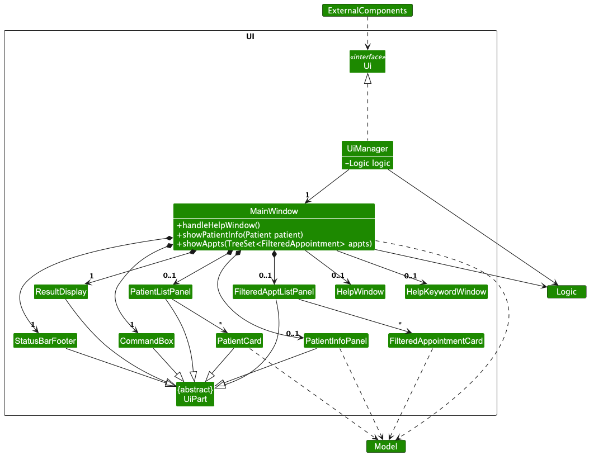

The UI consists of a `MainWindow` that is made up of parts e.g.`CommandBox`, `ResultDisplay`, `PatientListPanel`, `StatusBarFooter` etc. All these, including the `MainWindow`, inherit from the abstract `UiPart` class which captures the commonalities between classes that represent parts of the visible GUI.

The `UI` component uses the JavaFx UI framework. The layout of these UI parts are defined in matching `.fxml` files that are in the `src/main/resources/view` folder. For example, the layout of the [`MainWindow`](https://github.com/AY2425S1-CS2103T-F10-2/tp/tree/master/src/main/java/seedu/address/ui/MainWindow.java) is specified in [`MainWindow.fxml`](https://github.com/AY2425S1-CS2103T-F10-2/tp/tree/master/src/main/resources/view/MainWindow.fxml)

The `UI` component,

* executes user commands using the `Logic` component.
* listens for changes to `Model` data so that the UI can be updated with the modified data.
* keeps a reference to the `Logic` component, because the `UI` relies on the `Logic` to execute commands.
* depends on some classes in the `Model` component, as it displays `Patient` object residing in the `Model`.

### Logic component

**API** : [`Logic.java`](https://github.com/AY2425S1-CS2103T-F10-2/tp/tree/master/src/main/java/seedu/address/logic/Logic.java)

Here's a (partial) class diagram of the `Logic` component:

The sequence diagram below illustrates the interactions within the `Logic` component, taking `execute("delete T0123456A")` API call as an example.

:information_source: **Note:** The lifeline for `DeleteCommandParser` should end at the destroy marker (X) but due to a limitation of PlantUML, the lifeline continues till the end of diagram.

How the `Logic` component works:

1. When `Logic` is called upon to execute a command, it is passed to an `ClinicConnectSystemParser` object which in turn creates a parser that matches the command (e.g., `DeleteCommandParser`) and uses it to parse the command.
1. This results in a `Command` object (more precisely, an object of one of its subclasses e.g., `DeleteCommand`) which is executed by the `LogicManager`.
1. The command can communicate with the `Model` when it is executed (e.g. to delete a patient). 
   Note that although this is shown as a single step in the diagram above (for simplicity), in the code it can take several interactions (between the command object and the `Model`) to achieve.
1. The result of the command execution is encapsulated as a `CommandResult` object which is returned back from `Logic`.

Here are the other classes in `Logic` (omitted from the class diagram above) that are used for parsing a user command:

How the parsing works:
* When called upon to parse a user command, the `ClinicConnectSystemParser` class creates an `XYZCommandParser` (`XYZ` is a placeholder for the specific command name e.g., `AddCommandParser`) which uses the other classes shown above to parse the user command and create a `XYZCommand` object (e.g., `AddCommand`) which the `ClinicConnectSystemParser` returns back as a `Command` object.
* All `XYZCommandParser` classes (e.g., `AddCommandParser`, `DeleteCommandParser`, ...) inherit from the `Parser` interface so that they can be treated similarly where possible e.g, during testing.

### Model component
**API** : [`Model.java`](https://github.com/AY2425S1-CS2103T-F10-2/tp/tree/master/src/main/java/seedu/address/model/Model.java)

  

The `Model` component,

* stores the ClinicConnect system data i.e., all `Patient` objects (which are contained in a `UniquePatientList` object).
* stores all `FilteredAppointment` objects
* stores the currently 'selected' `Patient` objects (e.g., results of a search query) as a separate _filtered_ list which is exposed to outsiders as an unmodifiable `ObservableList<Patient>` that can be 'observed' e.g. the UI can be bound to this list so that the UI automatically updates when the data in the list change.
* stores a `UserPref` object that represents the user’s preferences. This is exposed to the outside as a `ReadOnlyUserPref` objects.
* does not depend on any of the other three components (as the `Model` represents data entities of the domain, they should make sense on their own without depending on other components)

### Storage component

**API** : [`Storage.java`](https://github.com/AY2425S1-CS2103T-F10-2/tp/tree/master/src/main/java/seedu/address/storage/Storage.java)

The `Storage` component,
* can save both address book data and user preference data in JSON format, and read them back into corresponding objects.
* inherits from both `AddressBookStorage` and `UserPrefStorage`, which means it can be treated as either one (if only the functionality of only one is needed).
* depends on some classes in the `Model` component (because the `Storage` component's job is to save/retrieve objects that belong to the `Model`)

### Common classes

Classes used by multiple components are in the `seedu.address.commons` package.

--------------------------------------------------------------------------------------------------------------------

## **Implementation**

### General Features
This section describes some noteworthy details on how certain features are implemented.

#### Help Command : `help`
The `help` command opens a separate help window detailing a summary of the commands available and their functions.  

The user can optionally provide a `COMMAND_KEYWORD` which opens a separate help window showing more information about the specified command.  

##### Parsing User Input
The `HelpCommmandParser` class is responsible for parsing user input to extract the `COMMAND_KEYWORD` which determines which help window to display.
It uses the `trim` method to remove any leading and trailing white-space characters from the user input.
If the user input is empty, the parser creates a `HelpCommand()` object. Alternatively, if a `COMMAND_KEYWORD` is provided, a `HelpCommand(COMMAND_KEYWORD)` object is instantiated, provided the keyword is valid.
The parser verifies the validity of the `COMMAND_KEYWORD` by ensuring it matches one of the command keywords supported by the application.

##### Executing the Command
The `HelpCommand` creates a `KeywordCommandResult` object which is handled in `MainWindow.java` to display the appropriate help window.

##### Activity Diagram
The following activity diagram illustrates the workflow of the execution of the `help` command:
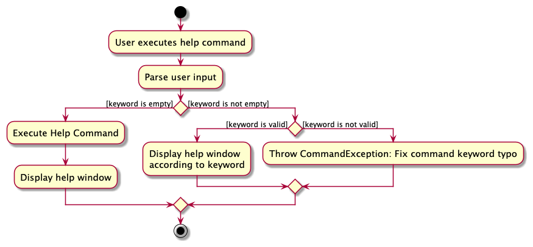

##### Design Considerations
The `help` command is designed to provide a quick summary of all the commands available in our application. Users can also use `help [COMMAND_KEYWORD]` to get more detailed information about a specific command.
Additionally, our help windows are designed to stay open, allowing users to refer to them while continuing to use the application.
For convenience, users can press the `esc` key to close the help windows easily, without needing to use the mouse to navigate to the close button.

#### Home Command : `home`
The `home` command returns the user to the home UI where all the patients are displayed.

##### Executing the Command
The `HomeCommand` sets the `filteredPatientList` to include all patients in the `Model` component and returns a `DefaultCommandResult`.
When the `MainWindow` is refreshed it then sets the view to be the default view which is the home UI where all the patients are displayed.

##### Design Considerations
We designed the `home` command to display all the patients as we wanted the user to have easy access to an overview of all the patients. This is useful because the UI changes often with the various commands used.

We also display the total number of patients in the system, providing users with a clearer overview of the clinic's customers.

#### Clear Command : `clear`
The `clear` command allows the user to delete all the patients and appointments from the ClinicConnect system.

##### Executing the Command
The `ClearCommand` sets the `ClinicConnectSystem` of the `Model` to be a new `ClinicConnectSystem` object. By doing so, there is no longer any reference to the previous `ClinicConnectSystem` object, effectively deleting all the patient and appointment records.

##### Design Considerations
The `clear` command was implemented so that users can easily remove the sample data and start afresh.

#### Exit Command : `exit`
The `exit` command allows the user to close all the tabs of the ClinicConnect system.

##### Executing the Command
The `ExitCommand` returns a `ExitCommandResult` which will eventually invoke the `handleExit` method in the `MainWindow` class causing all the windows (including help windows) to close.

##### Design Considerations
To stay true to the nature of a CLI-based application, we implemented the `exit` command so that the user can simply just type `exit` and close the application.

Furthermore, the `help` command opens a new window for each `COMMAND_KEYWORD`. Therefore, after a using the application, if the user wants to close the application, he/she will have to close each help window one by one.
To make this more convenient for the user, we made the `exit` command close all the help windows as well.

### Patient Management Features

#### Add Command : `add`
The `add` command is used to add a patient to the patient list quickly with only necessary details.

The user has to specify the patient's:
* NRIC (`Nric`)
* Name (`Name`)
* Date-of-Birth (`Birthdate`)
* Phone number (`Phone`)
* Sex (`Sex`)

##### Parsing User Input
The `AddCommandParser` class parses the user input to extract the various parameters that have been specified.
It first makes use of the `ArgumentTokenizer` class to ensure that the correct prefixes are present and then tokenizes all the input arguments. This returns an `ArgumentMultiMap` object which has extracted all the prefixes and their corresponding values.
The `ArgumentMultiMap` object is then used to ensure that all the required fields have been specified and ensure that there are no duplicate prefixes.

The sequence diagram below illustrates the process behind the parsing of the user input.
In this example, it takes an `add` command: `execute(add n|Abraham Tan i|S9758366N s|M d|1997-10-27 p|87596666)`

:information_source: **Note:** The lifeline for <code>AddCommandParser</code>,<code>ArgumentMultiMap</code> and <code>AddCommand</code> should end at the destroy marker (X) but due to a limitation of PlantUML, the lifeline reaches the end of diagram.

The parsing of the fields is as follows:

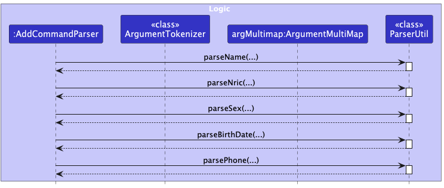

##### Executing the Command
The `AddCommand` class is initialized with a new `Patient` object created from the parsed input. The `Patient` object is then added to the `UniquePatientList` through the `addPatient` method in the `Model` component.

The activity diagram below illustrates the workflow behind the execution of the `add` command:

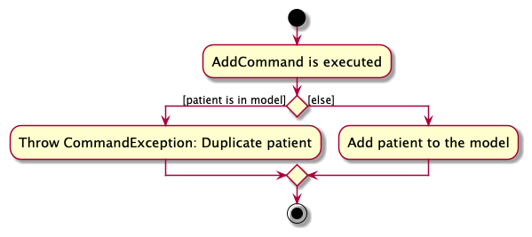

#### Design Considerations
**Using `Nric` as an unique identifier**  
Patients may have the same names and other fields. Therefore, unique NRICs will be used to distinguish between patients to prevent administrative errors.

#### Add Full Command : `addf`
The `addf` command is used to add a patient to the patient list.

The user has to specify the patient's:
* NRIC (`Nric`)
* Name (`Name`)
* Date-of-Birth (`Birthdate`)
* Phone number (`Phone`)
* Sex (`Sex`)

Additionally, the user can provide additional information for the following optional fields:
* Address (`Address`)
* Blood type (`BloodType`)
* Email (`Email`)
* Existing condition (`ExistingCondition`)
* Risk level (`HealthRisk`)
* Note (`Note`)
* Next-of-Kin name (`Name`)
* Next-of-Kin phone number (`Phone`)
* and Allergies (`Allergy`)

##### Parsing User Input
The `AddFCommandParser` class parses the user input to extract the various parameters that have been specified.
It first makes use of the `ArgumentTokenizer` class to ensure that the correct prefixes are present and then tokenizes all the input arguments. This returns an `ArgumentMultiMap` object which has extracted all the prefixes and their corresponding values.
The `ArgumentMultiMap` object is then used to ensure that all the required fields have been specified and ensure that there are no duplicate prefixes (except for `al` which is used for allergy)

The sequence diagram below illustrates the process behind the parsing of the user input.
In this example, it takes an `addf` command: `execute(addf n|Abraham Tan i|S9758366N s|M d|1997-10-27 p|87596666 e|abramhamtan@gmail.com a|Blk 123, NUS Road, S123123 b|A+ nokn|Licoln Tan nokp|91234567 al|nuts al|shellfish rl|HIGH ec|Diabetes no|Patient needs extra care)`

:information_source: **Note:** The lifeline for <code>AddFCommandParser</code>,<code>ArgumentMultiMap</code> and <code>AddFCommand</code> should end at the destroy marker (X) but due to a limitation of PlantUML, the lifeline reaches the end of diagram.

The parsing of the fields is as follows:

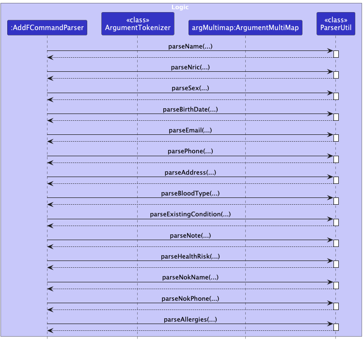

##### Executing the Command
The `AddFCommand` class is initialized with a new `Patient` object created from the parsed input. The `Patient` object is then added to the `UniquePatientList` through the `addPatient` method in the `Model` component.

The activity diagram below illustrates the workflow behind the execution of the `addf` command:

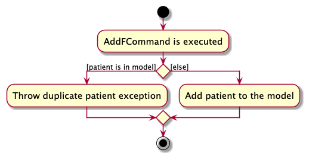

##### Design Considerations
**Using `Nric` Field as an unique identifier** 
Following the reasoning of why `Nric` is used as a unique identifier in `add` command, it is also used as a unique identifier in the `addf` command since both commands are fundamentally similar.

**Compulsory and Non-Compulsory Fields** 
The following fields are required as they are essential details that the clinic needs to know to serve a patient.
* NRIC (`Nric`)
* Name (`Name`)
* Date-of-Birth (`Birthdate`)
* Phone number (`Phone`)
* Sex (`Sex`)

The following fields are optional as they are not essential in serving a patient.
* Address (`Address`)
* Blood type (`BloodType`)
* Email (`Email`)
* Existing condition (`ExistingCondition`)
* Risk level (`HealthRisk`)
* Note (`Note`)
* Next-of-Kin name (`Name`)
* Next-of-Kin phone number (`Phone`)
* and Allergies (`Allergy`)

#### Edit Command : `edit`

#### Delete Command : `delete`
The `delete` command is used to delete a patient entry from the patient list.

The user has to specify the target patient's:
* NRIC (`Nric`)

##### Parsing User Input
The `DeleteCommandParser` class parses the user input to extract the NRIC parameter that has been specified.

##### Executing the Command
The `DeleteCommand` class is initialized and the `Patient` object with a matching NRIC with the argument is retrieved. The `Patient` object is then deleted from the `UniquePatientList` through the `deletePatient` method in the `Model` component.

##### Sequence Diagram
The sequence diagram below illustrates the process behind the parsing and execution of the user input.
In this example, it takes a `delete` command: `delete T0123456A`

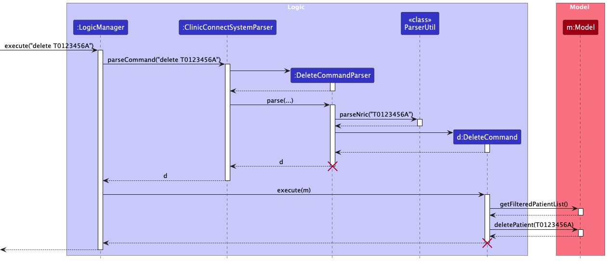

:information_source: **Note:** The lifeline for <code>DeleteCommandParser</code> and <code>DeleteCommand</code> should end at the destroy marker (X) but due to a limitation of PlantUML, the lifeline reaches the end of diagram.

##### Design Considerations
**Using `Nric` Field as a Unique Identifier** 
Following the reasoning of why `Nric` is used as a unique identifier in `add` command, it is also used as a unique identifier in the `delete` command since both commands are fundamentally similar.

**Compulsory and Non-Compulsory Fields** 
The following fields are required as they are essential details that the clinic needs to know to identify and delete a patient entry.
* NRIC (`Nric`)

#### View Command : `view`
The `view` command is used to display detailed information of a patient.

The user has to specify the target patient's:
* NRIC (`Nric`)

##### Parsing User Input
The `ViewCommandParser` class parses the user input to extract the NRIC parameter that has been specified.

##### Executing the Command
The `ViewCommand` class is initialized and the `Patient` object with a matching NRIC with the argument is retrieved. A `PatientInfoPanel` containing detailed information about the patient entry is then displayed in the `guiPanelPlaceholder` section of the UI.

##### Sequence Diagram
The sequence diagram below illustrates the process behind the parsing and execution of the user input.
In this example, it takes a `view` command: `view T0123456A`

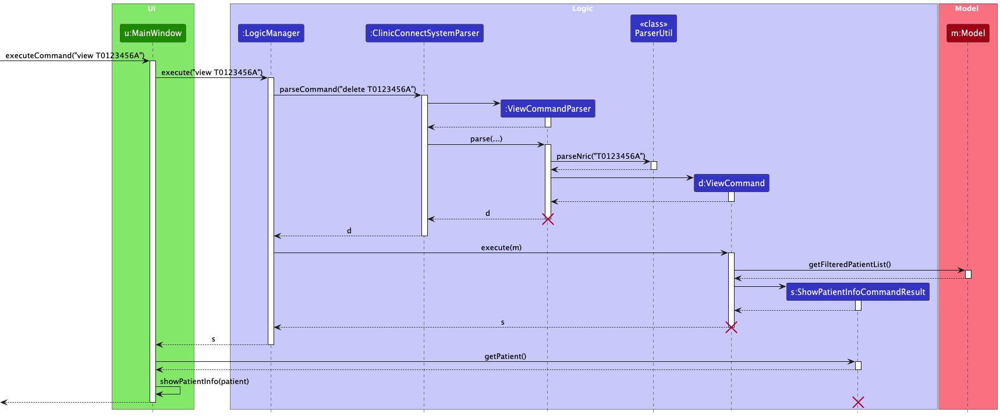

:information_source: **Note:** The lifeline for <code>ViewCommandParser</code> and <code>ViewCommand</code> should end at the destroy marker (X) but due to a limitation of PlantUML, the lifeline reaches the end of diagram.

##### Design Considerations
**Using `Nric` Field as a Unique Identifier** 
Following the reasoning of why `Nric` is used as a unique identifier in `add` command, it is also used as a unique identifier in the `view` command.

**Compulsory and Non-Compulsory Fields** 
The following fields are required as they are essential details that the clinic needs to know to identify and delete a patient entry.
* NRIC (`Nric`)

### Appointment Management Features

#### Book Appointment : `bookappt`
The `bookappt` command is used to book an upcoming appointment for the patient with the corresponding NRIC.

The user has to specify:
* Patient's NRIC (`Nric`)
* Upcoming appointment date and time to be booked (`LocalDateTime`)
* Health service the patient is receiving (`Healthservice`)

##### Parsing User Input
The `BookApptCommandParser` class parses the user input to extract the various parameters that have been specified.
It first makes use of the `ArgumentTokenizer` class to ensure that the correct prefixes are present and then tokenizes all the input arguments. This returns an `ArgumentMultiMap` object which has extracted the NRIC before any prefixes, all the prefixes and their corresponding values.
The `ArgumentMultiMap` object is then used to ensure that all the required fields have been specified and ensure that there are no duplicate prefixes.

##### Executing the Command
The `BookApptCommand` class is initialized with a new `Appt` object, which represents appointment, created from the parsed input. With the NRIC input, a validity check is conducted, after which the `Patient` with the corresponding NRIC is then identified. After checking for duplicates in appointment and whether the date and time inputs are past today's date, the `Appt` object is then added to the `Patient` identified.

##### Activity Diagram
The activity diagram below illustrates the workflow behind the execution of the `bookappt` command:

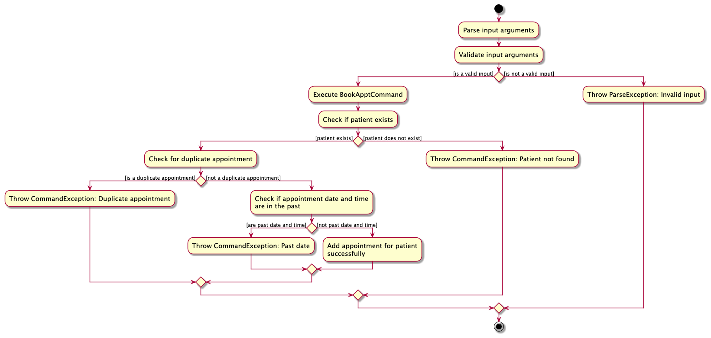

##### Design Considerations
The `bookappt` command uses `Nric` as a unique identifier to book an upcoming appointment for the patient identified. `LocalDateTime` and `Healthservice` are required fields to ensure that each upcoming appointment added for the `Patient` is unique.

#### Delete Appointment : `deleteappt`
The `deleteappt` command is used to delete an appointment for the patient with the corresponding NRIC.

The user has to specify:
* Patient's NRIC (`Nric`)
* Appointment date and time to be deleted (`LocalDateTime`)

##### Parsing User Input
The `DeleteApptCommandParser` class parses the user input to extract the various parameters that have been specified.
It first makes use of the `ArgumentTokenizer` class to ensure that the correct prefixes are present and then tokenizes all the input arguments. This returns an `ArgumentMultiMap` object which has extracted the NRIC before any prefixes, the `dt|` prefix and its corresponding value.
The `ArgumentMultiMap` object is then used to ensure that all the required fields have been specified and ensure that there are no duplicate prefixes.

##### Executing the Command
In `DeleteApptCommand`, with the NRIC input, a validity check is conducted, after which the `Patient` with the corresponding NRIC is then identified. The `Appt` object, which represents appointment, with the corresponding date and time is then identified. After checking for the validity of the appointment, the `Appt` object is then deleted from the `Patient` identified.

##### Activity Diagram
The activity diagram below illustrates the workflow behind the execution of the `deleteappt` command:

##### Design Considerations
The `deleteappt` command uses `Nric` as a unique identifier to delete an appointment for the patient identified. `LocalDateTime` is the required field to ensure that a unique appointment is deleted from the `Patient`.

#### Filter Appointment : `filter`

The `filter` command lets users search for a list of patients' appointments based on a date range and health service.

The user can specify the
* end date of the date range

and optionally provide the
* start date of the date range
* `HealthService` that matches the purpose of the appointment

If the start date is not provided, the start date is set to today's date. Furthermore, if health service is not provided, all appointments in
the date range will be shown.

##### Parsing User Input

The `FilterCommandParser` class is responsible for parsing user input to extract the details of the date range and
health service to be added. It uses the `ArgumentTokenizer` to tokenize the input string, extracting prefixes and their associated values.
It returns an `ArgumentMultiMap` object which is used to create a `AppointmentDateFilter` object with the start and end date
and `HealthService`.

##### Sequence Diagram

The sequence diagram below illustrates the process behind the parsing of the user input.
In this example, it takes an `filter` command: `execute(filter sd|2022-10-01 ed|2022-11-01 h|Blood Test)`

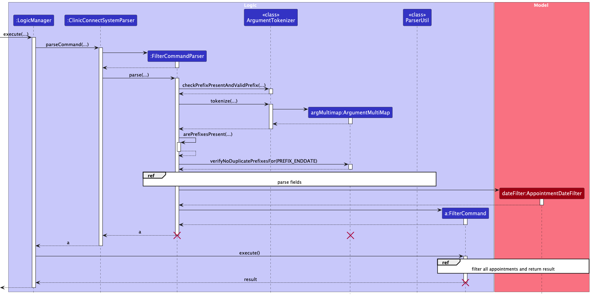

:information_source: **Note:** The lifeline for <code>FilterCommandParser</code>,<code>ArgumentMultiMap</code> and <code>FilterCommand</code> should end at the destroy marker (X) but due to a limitation of PlantUML, the lifeline reaches the end of diagram.

The parsing of the fields is as follows:

##### Executing the Command

The `FilterCommand` class then filters through all the appointments in the `Model` component and selects those which lie within the date range and matches the healthservice.
This is done though the `filterAppts` method in the `Model` component. This method iterates through all patients and checks if
each appointment falls within the date range and matches the `HealthService` if provided.

The filtered appointments are then sorted and stored in the model.

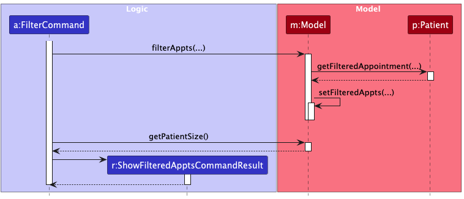

##### Design Considerations

The `filter` command is designed such that the user has versatility in filtering appointments.

1. If the user specifies all fields, the appointments that lie within the date range and matches the `HealthService` will be returned.
2. If the user specifies the end date and health service, the appointment that lies from today's date to end date and matches the `HealthService` will be displayed.
3. If the user specifies the start and end date, all appointments that lies from start to end date will be shown.
4. If the user only specifies end date, all appointments that lies from today's to end date will be displayed.
5. If the user wants to show appointments on a single day, the user can specify the start and end date as the same date.

### \[Proposed\] Undo/redo feature

#### Proposed Implementation

The proposed undo/redo mechanism is facilitated by `VersionedAddressBook`. It extends `AddressBook` with an undo/redo history, stored internally as an `addressBookStateList` and `currentStatePointer`. Additionally, it implements the following operations:

* `VersionedAddressBook#commit()` — Saves the current address book state in its history.
* `VersionedAddressBook#undo()` — Restores the previous address book state from its history.
* `VersionedAddressBook#redo()` — Restores a previously undone address book state from its history.

These operations are exposed in the `Model` interface as `Model#commitAddressBook()`, `Model#undoAddressBook()` and `Model#redoAddressBook()` respectively.

Given below is an example usage scenario and how the undo/redo mechanism behaves at each step.

Step 1. The user launches the application for the first time. The `VersionedAddressBook` will be initialized with the initial address book state, and the `currentStatePointer` pointing to that single address book state.

Step 2. The user executes `delete 5` command to delete the 5th patient in the address book. The `delete` command calls `Model#commitAddressBook()`, causing the modified state of the address book after the `delete 5` command executes to be saved in the `addressBookStateList`, and the `currentStatePointer` is shifted to the newly inserted address book state.

Step 3. The user executes `add n/David …​` to add a new patient. The `add` command also calls `Model#commitAddressBook()`, causing another modified address book state to be saved into the `addressBookStateList`.

:information_source: **Note:** If a command fails its execution, it will not call `Model#commitAddressBook()`, so the address book state will not be saved into the `addressBookStateList`.

Step 4. The user now decides that adding the patient was a mistake, and decides to undo that action by executing the `undo` command. The `undo` command will call `Model#undoAddressBook()`, which will shift the `currentStatePointer` once to the left, pointing it to the previous address book state, and restores the address book to that state.

:information_source: **Note:** If the `currentStatePointer` is at index 0, pointing to the initial AddressBook state, then there are no previous AddressBook states to restore. The `undo` command uses `Model#canUndoAddressBook()` to check if this is the case. If so, it will return an error to the user rather
than attempting to perform the undo.

The following sequence diagram shows how an undo operation goes through the `Logic` component:

:information_source: **Note:** The lifeline for `UndoCommand` should end at the destroy marker (X) but due to a limitation of PlantUML, the lifeline reaches the end of diagram.

Similarly, how an undo operation goes through the `Model` component is shown below:

The `redo` command does the opposite — it calls `Model#redoAddressBook()`, which shifts the `currentStatePointer` once to the right, pointing to the previously undone state, and restores the address book to that state.

:information_source: **Note:** If the `currentStatePointer` is at index `addressBookStateList.size() - 1`, pointing to the latest address book state, then there are no undone AddressBook states to restore. The `redo` command uses `Model#canRedoAddressBook()` to check if this is the case. If so, it will return an error to the user rather than attempting to perform the redo.

Step 5. The user then decides to execute the command `list`. Commands that do not modify the address book, such as `list`, will usually not call `Model#commitAddressBook()`, `Model#undoAddressBook()` or `Model#redoAddressBook()`. Thus, the `addressBookStateList` remains unchanged.

Step 6. The user executes `clear`, which calls `Model#commitAddressBook()`. Since the `currentStatePointer` is not pointing at the end of the `addressBookStateList`, all address book states after the `currentStatePointer` will be purged. Reason: It no longer makes sense to redo the `add n/David …​` command. This is the behavior that most modern desktop applications follow.

The following activity diagram summarizes what happens when a user executes a new command:

#### Design considerations:

**Aspect: How undo & redo executes:**

* **Alternative 1 (current choice):** Saves the entire address book.
  * Pros: Easy to implement.
  * Cons: May have performance issues in terms of memory usage.

* **Alternative 2:** Individual command knows how to undo/redo by
  itself.
  * Pros: Will use less memory (e.g. for `delete`, just save the patient being deleted).
  * Cons: We must ensure that the implementation of each individual command are correct.

_{more aspects and alternatives to be added}_

### \[Proposed\] Data archiving

_{Explain here how the data archiving feature will be implemented}_

--------------------------------------------------------------------------------------------------------------------

## **Documentation, logging, testing, configuration, dev-ops**

* [Documentation guide](Documentation.md)
* [Testing guide](Testing.md)
* [Logging guide](Logging.md)
* [Configuration guide](Configuration.md)
* [DevOps guide](DevOps.md)

--------------------------------------------------------------------------------------------------------------------

## **Appendix: Requirements**

### Product scope

**Target user profile**:

* works in a private health screening clinic as a clinic assistant
* attends to new and existing patients who come to the clinic for health screening purposes
* has a need to manage a significant number of patient details
* can type fast
* prefers typing to mouse interactions
* is reasonably comfortable using CLI apps

**Value proposition**:
* allow clinic assistants to perform many clinic-related tasks in one place
* contain specific fields unique to healthcare screening clinics which clinic assistants can gain easy access to, such as patient screening dates, patient screening packages, payment dues, insurance providers, insurance processing status
* provide fast access to patient information through smart search and filter capabilities
* automate reminder messages for patient consultations and sending of patients' Test/Scan results
* provide different GUI views for different clinic concerns

### User stories

Priorities: High (must have) - `* * *`, Medium (nice to have) - `* *`, Low (unlikely to have) - `*`

| Priority | As a …​                                     | I want to …​                                                                        | So that I can…​                                                         |
| -------- | ------------------------------------------ | ---------------------------------------------------------------------------------- | ---------------------------------------------------------------------- |
| `* * *`  | clinic assistant                           | view all patients' data                                                            | perform administrative tasks                                           |
| `* * *`  | clinic assistant                           | add a new patient                                                                  | register new patients                                                  |
| `* * *`  | clinic assistant                           | delete a patient                                                                   | remove patient details that I no longer need                           |
| `* * *`  | clinic assistant                           | have a user guide to orientate me around the platform                              | understand how to use the platform                                     |
| `* * *`  | clinic assistant                           | be stopped from creating a patient entry for a patient who has registered before   | there are no duplicate records                                         |
| `* * *`  | clinic assistant                           | have a standardized format for recording patient details and records               | variations in recording methods do not hinder administrative processes |
| `* * *`  | clinic assistant                           | get information on a patient's visits                                              | i can contact their insurance company for claims                       |
| `* * *`  | clinic assistant                           | get past existing conditions of a patient                                               | assist in the diagnosis of the patient during screening                |
| `* * *`  | clinic assistant                           | know what package a patient is coming in for                                       | prepare the patients for their tests                                   |
| `* * *`  | clinic assistant                           | know what tests a patient did                                                      | provide patients a tentative date for the release of their results     |
| `* *`    | clinic assistant                           | be able to input notes and information in patient's particulars                    | refer to the notes and settle administrative matters more smoothly     |
| `* *`    | clinic assistant                           | input a priority level for the patients at high risk                               | ensure that they will be attended to properly and in time              |
| `* *`    | clinic assistant                           | view list of patients with matching parts of names as what I typed in search bar   | locate details of patients without having to go through the entire list |
| `* *`    | clinic assistant                           | restrict access to sensitive patient details from part-time clinic staff           | minimize chance of someone else seeing them by accident                |
| `*`      | clinic assistant                           | check the payment balance of the customers                                         | remind them to pay their outstanding bills                             |
| `*`      | clinic assistant                           | see a summary of the patient when i click on the profile                           | save time scrolling through their profiles                             |

### Use cases

(For all use cases below, the **System** is the `ClinicConnect` and the **Actor** is the `user`, unless specified otherwise)

#### Use case: UC01 - Add a patient
**Guarantees:** 
A patient will be added to the system if the patient is not already in the system.

**MSS:**

1.  User types command to add patient and inputs details for the new patient.
2.  ClinicConnect adds the patient to the system successfully.

    Use case ends.

**Extensions**

* 1a. User inputs an invalid prefix
    * 1a1. ClinicConnect shows an error message stating that the prefix is invalid. 
      Step 1a1 is repeated until the input entered only contains valid prefixes 
      Use case resumes from step 2.
       
       

* 1b. User does not input all the required parameters
    * 1b1. ClinicConnect shows an error message saying 'Invalid command format!'. 
      Step 1b1 is repeated until the input entered is valid containing all the required parameters 
      Use case resumes from step 2.
       
       

* 1c. User inputs a field in the wrong format.
    * 1c1. ClinicConnect prompts the user to fix the field that is wrong and shows the correct format. 
      Step 1c1 is repeated until the field is in the correct format 
      Use case resumes from step 2.
 
 

* 1d. User inputs duplicate prefixes.
    * 1d1. ClinicConnect shows an error message stating that there is a duplicate prefix. 
      Step 1d1 is repeated until the input entered has distinct prefixes 
      Use case resumes from step 2.
 
 

* 1e. User inputs an NRIC that already exists in the system.
    * 1e1. ClinicConnect shows an error message saying the patient already exists in the system. 
      Step 1e1 is repeated until a new NRIC that is not in the system is inputted 
      Use case resumes from step 2.

#### Use case: UC02 - Add a patient with all fields
**Guarantees:** 
A patient will be added to the system if the patient is not already in the system

**MSS:**

1.  User types command to add patient and inputs details for the new patient
2.  ClinicConnect adds the patient to the system

    Use case ends.

**Extensions**

* 1a. User inputs an invalid prefix
    * 1a1. ClinicConnect shows an error message stating that the prefix is invalid. 
      Step 1a1 is repeated until the input entered only contains valid prefixes 
      Use case resumes from step 2.
       
       

* 1b. User does not input all the required parameters
    * 1b1. ClinicConnect shows an error message saying 'Invalid command format!'. 
      Step 1b1 is repeated until the input entered is valid containing all the required parameters 
      Use case resumes from step 2.
       
       

* 1c. User inputs a field in the wrong format
    * 1c1. ClinicConnect prompts the user to fix the field that is wrong and shows the correct format. 
      Step 1c1 is repeated until the field is in the correct format 
      Use case resumes from step 2.
       
       

* 1d. User inputs duplicate prefixes (except for `al`)
    * 1d1. ClinicConnect shows an error message stating that there is a duplicate prefix. 
      Step 1d1 is repeated until the input entered has distinct prefixes 
      Use case resumes from step 2.
       
       

* 1e. User inputs an NRIC that already exists in the system
    * 1e1. ClinicConnect shows an error message saying the patient already exists in the system. 
      Step 1e1 is repeated until a new NRIC that is not in the system is inputted 
      Use case resumes from step 2.

#### Use case: UC03 - Book an upcoming appointment for a patient
**Preconditions:** The patient with the corresponding NRIC is already registered in the system. 
**Guarantees:** Appointments only will be booked if they consist of valid date and time in the future

**MSS**

1.  User types the command to book an upcoming appointment for the patient with the corresponding NRIC.
2.  ClinicConnect books an upcoming appointment for the patient successfully.

    Use case ends.

**Extensions**

* 1a. User inputs an invalid prefix.
    * 1a1. ClinicConnect shows an error message saying the prefix is invalid. 
      Step 1a1 is repeated until the input entered only contains valid prefixes. 
      Use case resumes from step 2.
       
       

* 1b. User does not input all the required parameters.
    * 1b1. ClinicConnect shows an error message saying 'Invalid command format!'. 
      Step 1b1 is repeated until the input entered is valid containing all the required parameters. 
      Use case resumes from step 2.
       
       

* 1c. User inputs a field in the wrong format.
    * 1c1. ClinicConnect prompts the user to fix the field that is wrong and shows the correct format. 
      Step 1c1 is repeated until the field is in the correct format. 
      Use case resumes from step 2.
       
       

* 1d. User inputs an NRIC that does not exist in the system due to a typo.
    * 1d1. ClinicConnect shows an error message and prompts the user to input a valid NRIC of an existing patient in the system. 
      Step 1d1 is repeated until a valid NRIC that is in the system is inputted. 
      Use case resumes from step 2.
       
       

* 1e. User inputs duplicate appointments.
    * 1e1. ClinicConnect shows an error message and prompts the user to input a valid appointment that is not in the patient's list of appointments. 
      Step 1e1 is repeated until a valid appointment that is not in the patient's list of appointments is inputted. 
      Use case resumes from step 2.
       
       

* 1f. User inputs date and time that are in the past.
    * 1f1. ClinicConnect shows an error message and prompts the user to input date and time that are not in the past. 
      Step 1f1 is repeated until future date and time are inputted. 
      Use case resumes from step 2.

#### Use case: US04 - Delete an appointment for a patient
**Preconditions:** 
The patient with the corresponding NRIC is already registered in the system. 
**Guarantees:** Valid appointments will be deleted if they are already in the patient's list of appointments.

**MSS**

1.  User types the command to delete an appointment for the patient with the corresponding NRIC.
2.  ClinicConnect deletes an appointment for the patient successfully.

    Use case ends.

**Extensions**

* 1a. User inputs an invalid prefix.
    * 1a1. ClinicConnect shows an error message saying the prefix is invalid. 
      Step 1a1 is repeated until the input entered only contains valid prefixes. 
      Use case resumes from step 2.
       
       

* 1b. User does not input all the required parameters.
    * 1b1. ClinicConnect shows an error message saying 'Invalid command format!'. 
      Step 1b1 is repeated until the input entered is valid containing all the required parameters. 
      Use case resumes from step 2.
       
       

* 1c. User inputs a field in the wrong format.
    * 1c1. ClinicConnect prompts the user to fix the field that is wrong and shows the correct format. 
      Step 1c1 is repeated until the field is in the correct format. 
      Use case resumes from step 2.
       
       

* 1d. User inputs an NRIC that does not exist in the system due to a typo.
    * 1d1. ClinicConnect shows an error message and prompts the user to input a valid NRIC of an existing patient in the system. 
      Step 1d1 is repeated until a valid NRIC that is in the system is inputted. 
      Use case resumes from step 2.
       
       

* 1e. User inputs an appointment that is not found in the patient's list of appointments.
    * 1e1. ClinicConnect shows an error message and prompts the user to input a valid appointment that is in the patient's list of appointments. 
      Step 1e1 is repeated until a valid appointment in the patient's list of appointments is inputted. 
      Use case resumes from step 2.

#### Use case: UC06 - Delete a patient
**Guarantees:** 
A patient will be deleted from the system if the patient is already in the system.

**MSS:**

1.  User types the command to delete a patient with the corresponding NRIC.
2.  ClinicConnect deletes the patient from the system successfully.

    Use case ends.

**Extensions**

* 1a. User does not input the NRIC of a patient.
    * 1a1. ClinicConnect shows an error message saying 'Invalid command format!'. 
      Step 1a1 is repeated until the input entered is a valid NRIC of a patient in the system. 
      Use case resumes from step 2.
 
 

* 1b. User inputs an invalid prefix.
    * 1b1. ClinicConnect shows an error message saying the prefix is invalid. 
      Step 1b1 is repeated until the input entered only contains valid prefixes. 
      Use case resumes from step 2.
 
 

* 1c. User inputs the patient's NRIC in the wrong format.
    * 1c1. ClinicConnect prompts the user to fix the format of the NRIC and shows the correct format. 
      Step 1c1 is repeated until the NRIC is in the correct format. 
      Use case resumes from step 2.
 
 

* 1d. User inputs an NRIC that does not exist in the system.
    * 1d1. ClinicConnect shows an error message saying the patient is not found in the system. 
      Step 1d1 is repeated until a valid NRIC that is in the system is inputted. 
      Use case resumes from step 2.

#### Use case: UC08 - Edit a patient
**Preconditions:** 
The patient with the corresponding NRIC is already registered in the system. 
**Guarantees:** 
At least one field of the patient will be edited

**MSS:**

1.  User types command to edit a patient
2.  ClinicConnect edits the patient in the system

    Use case ends.

**Extensions**

* 1a. User inputs an invalid prefix
    * 1a1. ClinicConnect shows an error message stating that the prefix is invalid. 
      Step 1a1 is repeated until the input entered only contains valid prefixes 
      Use case resumes from step 2.
       
       

* 1b. User does not input a field to be edited
    * 1b1. ClinicConnect shows an error message stating 'No valid prefixes found'. 
      Step 1b1 is repeated until the input entered is valid containing all the required parameters 
      Use case resumes from step 2.
       
       

      
* 1c. User inputs a field in the wrong format
    * 1c1. ClinicConnect prompts the user to fix the field that is wrong and shows the correct format. 
      Step 1c1 is repeated until the field is in the correct format 
      Use case resumes from step 2.
       
       

* 1d. User inputs duplicate prefixes (except for `al` and `rmal`)
    * 1d1. ClinicConnect shows an error message stating that there is a duplicate prefix. 
      Step 1d1 is repeated until the input entered has distinct prefixes 
      Use case resumes from step 2.
       
       

* 1e. User inputs an invalid NRIC
    * 1e1. ClinicConnect prompts the user to fix the NRIC and shows the correct format. 
      Step 1e1 is repeated until NRIC is in the correct format 
      Use case resumes from step 2.
       
       

* 1f. User inputs an NRIC that is not in the system
    * 1f1. ClinicConnect shows an error message stating that a patient with that NRIC does not exist  
      Step 1f1 is repeated until a patient corresponding to the NRIC exists in the system 
      Use case resumes from step 2.
       
       

* 1g. User attempts to add an allergy that already exists
    * 1g1. ClinicConnect shows an error message stating that the allergy already exists. 
      Step 1g1 is repeated until the allergy to be added does not already exist for the patient 
      Use case resumes from step 2.
       
       

* 1h. User attempts to remove an allergy that does not exist
    * 1h1. ClinicConnect shows an error message stating that the allergy does not exist for the patient. 
      Step 1h1 is repeated until the allergy to be removed exists 
      Use case resumes from step 2.
       
       

* 1h. User attempts to change the patient's NRIC to another NRIC that exists in the system
    * 1h1. ClinicConnect shows an error message stating that this patient already exists in the system. 
      Step 1h1 is repeated until the NRIC to be changed to does not exist in the system 
      Use case resumes from step 2.

### Non-Functional Requirements

1.  Should work on any _mainstream OS_ as long as it has Java `17` or above installed.
2.  Should be able to hold up to 1000 patients without a noticeable sluggishness in performance for typical usage.
3.  A user with above average typing speed for regular English text (i.e. not code, not system admin commands) should be able to accomplish most of the tasks faster using commands than using the mouse.
4.  Should be able to perform all of its functions without depending on external APIs.
5.  Should start up in less than 5 seconds on an average device running any _mainstream OS_ with Java `17` or above installed.
6.  Should have automated backups of patient data every 6 hours. Daily full backups should be stored offsite.
7.  In the event of data loss, the system must be able to recover from the latest backup with minimal data loss (less than 30 minutes of data).
8.  A first-time user should be able to navigate and perform basic tasks (e.g. adding a patient, searching for records) within 10 minutes of using the platform without prior training.
9.  The system should maintain comprehensive logs of all user actions, especially concerning patient record access, modifications, and deletions. These logs should be easily accessible for auditing purposes and stored for at least 5 years.

### Glossary

* **API (Application Programming Interface)**: A set of rules and tools that allows one piece of software to communicate with another.
* **Component**: A modular part of a software system that has a well-defined purpose.
* **Command**: A specific instruction given to the system to perform an action.
* **Mainstream OS**: Windows, Linux, Unix, MacOS
* **Private contact detail**: A contact detail that is not meant to be shared with others

--------------------------------------------------------------------------------------------------------------------

## **Appendix: Instructions for manual testing**

Given below are instructions to test the app manually.

:information_source: **Note:** These instructions only provide a starting point for testers to work on;
testers are expected to do more *exploratory* testing.

### Launch and shutdown

1. Initial launch

   1. Download the jar file and copy into an empty folder

   1. Double-click the jar file Expected: Shows the GUI with a set of sample contacts. The window size may not be optimum.

1. Saving window preferences

   1. Resize the window to an optimum size. Move the window to a different location. Close the window.

   1. Re-launch the app by double-clicking the jar file. 
       Expected: The most recent window size and location is retained.

1. _{ more test cases …​ }_

### Deleting a patient

1. Deleting a patient while all patients are being shown

   1. Prerequisites: List all patients using the `list` command. Multiple patients in the list.

   1. Test case: `delete 1` 
      Expected: First contact is deleted from the list. Details of the deleted contact shown in the status message. Timestamp in the status bar is updated.

   1. Test case: `delete 0` 
      Expected: No patient is deleted. Error details shown in the status message. Status bar remains the same.

   1. Other incorrect delete commands to try: `delete`, `delete x`, `...` (where x is larger than the list size) 
      Expected: Similar to previous.

1. _{ more test cases …​ }_

### Saving data

1. Dealing with missing/corrupted data files

   1. _{explain how to simulate a missing/corrupted file, and the expected behavior}_

1. _{ more test cases …​ }_
